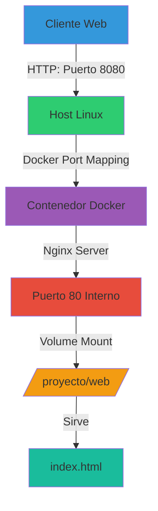
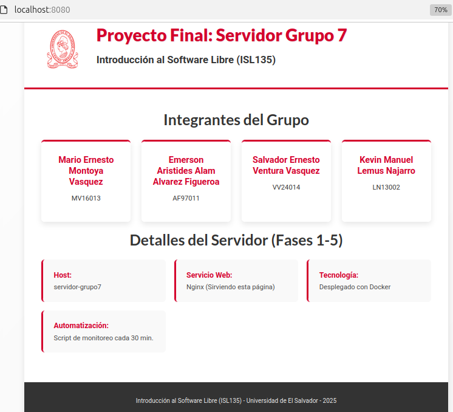

<div align="center">

<!-- Logo de la Universidad -->


# 🐧 Servidor Linux Automatizado con Docker
### Proyecto Final - Introducción al Software Libre


**Universidad de El Salvador**  
**Facultad Multidisciplinaria de Occidente**  
**Departamento de Ingeniería y Arquitectura**  
**Ingenieria en Desarollo de Software**

</div>

---

## Tabla de Contenidos

- [Descripción](#-descripción)
- [Equipo de Desarrollo](#-equipo-de-desarrollo)
- [Repositorio](#-repositorio)
- [Objetivos](#-objetivos)
- [Arquitectura del Sistema](#-arquitectura-del-sistema)
- [Instalación y Configuración](#-instalación-y-configuración)
- [Componentes del Proyecto](#-componentes-del-proyecto)
- [Monitoreo y Automatización](#-monitoreo-y-automatización)
- [Despliegue Web](#-despliegue-web)
- [Verificación](#-verificación)
- [Estado del Proyecto](#-estado-del-proyecto)

---

## Descripción

Este proyecto implementa un **servidor Linux completamente automatizado** utilizando tecnologías de código abierto y contenedores Docker. Integra las mejores prácticas de:

- 🔧 **Administración de sistemas Linux**
- 📦 **Virtualización con Docker**
- ⚙️ **Automatización de tareas con Bash y Cron**
- 🌐 **Despliegue de servicios web containerizados**
- 🔄 **Control de versiones con Git/GitHub**
- 📊 **Monitoreo de recursos del sistema**

El proyecto aplica los conocimientos adquiridos en la asignatura **Introducción al Software Libre (ISL135)** de la Universidad de El Salvador.

---

## Equipo de Desarrollo

<table>
<tr>
<th>Nombre Completo</th>
<th>Carné</th>
<th>Rol</th>
</tr>
<tr>
<td>Kevin Manuel Lemus Najarro</td>
<td><code>LN13002</code></td>
<td>Administración del Sistema</td>
</tr>
<tr>
<td>Mario Ernesto Montoya Vásquez</td>
<td><code>MV16013</code></td>
<td>Automatización y Scripts</td>
</tr>
<tr>
<td>Emerson Aristides Alam Álvarez Figueroa</td>
<td><code>AF97011</code></td>
<td>Docker y Contenedores</td>
</tr>
<tr>
<td>Salvador Ernesto Ventura Vázquez</td>
<td><code>VV24014</code></td>
<td>Despliegue Web y Documentación</td>
</tr>
</table>

**Grupo:** 7  
**Asignatura:** ISL135 - Introducción al Software Libre GT02 
**Ciclo:** 02-2025  
**Docente:** Ing. Graciela Albaluz Escalante Grijalva

---

## Repositorio

<div align="center">

[](https://github.com/ISL135-Grupo7/ProyectoFinal.git)

**URL:** `https://github.com/ISL135-Grupo7/ProyectoFinal`

</div>

---

##  Objetivos

### Objetivo General

Implementar un servidor Linux automatizado que integre administración del sistema, control de versiones, automatización de tareas, virtualización con Docker y despliegue de servicios web containerizados.

### Objetivos Específicos

1. ✅ Configurar un entorno de servidor Linux con gestión de usuarios y permisos
2. ✅ Implementar scripts de monitoreo automatizado del sistema
3. ✅ Establecer control de versiones mediante Git y GitHub
4. ✅ Desplegar servicios web usando contenedores Docker
5. ✅ Automatizar tareas periódicas mediante Cron
6. ✅ Documentar el proceso completo de implementación

---

## Arquitectura del Sistema

```
┌─────────────────────────────────────────────────────────┐
│                   SERVIDOR LINUX                        │
│                  servidor-grupo7                        │
├─────────────────────────────────────────────────────────┤
│                                                         │
│  ┌──────────────┐  ┌──────────────┐  ┌─────────────┐    │
│  │   Usuarios   │  │  Directorios │  │   Permisos  │    │
│  │              │  │              │  │             │    │
│  │ • adminsys   │  │ /proyecto/   │  │ SGID bits   │    │
│  │ • tecnico    │  │ ├─ datos/    │  │ soporte/web │    │
│  │ • visitante  │  │ ├─ web/      │  │             │    │
│  └──────────────┘  │ ├─ scripts/  │  └─────────────┘    │
│                    │ └─ capturas/ │                     │
│                    └──────────────┘                     │
├─────────────────────────────────────────────────────────┤
│                    AUTOMATIZACIÓN                       │
│                                                         │
│  ┌──────────────────────┐  ┌─────────────────────────┐  │
│  │   Cron (*/30 min)    │  │  reporte_sistema.sh     │  │
│  │                      │  │                         │  │
│  │ Ejecuta monitoreo    │─>│ • Hostname              │  │
│  │ cada 30 minutos      │  │ • Usuarios conectados   │  │
│  │                      │  │ • Espacio en disco      │  │
│  └──────────────────────┘  │ • Memoria RAM           │  │
│                            │ • Contenedores Docker   │  │
│                            └─────────────────────────┘  │
├─────────────────────────────────────────────────────────┤
│                    DOCKER ENGINE                        │
│                                                         │
│  ┌───────────────────────────────────────────────────┐  │
│  │          Contenedor: nginx_oficial                │  │
│  │                                                   │  │
│  │  ┌─────────────────────────────────────────────┐  │  │
│  │  │         Nginx Web Server                    │  │  │
│  │  │                                             │  │  │
│  │  │  Puerto: 8080:80                            │  │  │
│  │  │  Volumen: /proyecto/web → /usr/share/nginx  │  │  │
│  │  │  Modo: Read-Only                            │  │  │
│  │  │                                             │  │  │
│  │  │  Sirve: index.html personalizado            │  │  │
│  │  └─────────────────────────────────────────────┘  │  │
│  └───────────────────────────────────────────────────┘  │
├─────────────────────────────────────────────────────────┤
│                  CONTROL DE VERSIONES                   │
│                                                         │
│  ┌──────────────┐         ┌────────────────────────┐    │
│  │  Git Local   │ ─push─> │  GitHub Remote         │    │
│  │              │         │  ISL135-Grupo7/        │    │
│  │ /proyecto/   │ <─pull─ │  ProyectoFinal         │    │
│  └──────────────┘         └────────────────────────┘    │
└─────────────────────────────────────────────────────────┘
```

---

## Instalación y Configuración

### Requisitos Previos


- **RAM:** Mínimo 2 GB (recomendado 4 GB)
- **Disco:** Mínimo 20 GB disponibles
- **Red:** Conexión a Internet para descargar paquetes
- **Permisos:** Acceso root o sudo

### Paso 1: Preparación del Sistema

```bash
# Actualizar el sistema
sudo apt update && sudo apt upgrade -y

# Instalar herramientas esenciales
sudo apt install -y curl wget git vim net-tools

# Cambiar hostname
sudo hostnamectl set-hostname servidor-grupo7
```

### Paso 2: Gestión de Usuarios y Grupos

```bash
# Crear usuarios
sudo useradd -m -s /bin/bash adminsys
sudo useradd -m -s /bin/bash tecnico
sudo useradd -m -s /bin/bash visitante

# Establecer contraseñas
sudo passwd adminsys
sudo passwd tecnico
sudo passwd visitante

# Crear grupos
sudo groupadd soporte
sudo groupadd web

# Asignar usuarios a grupos
sudo usermod -aG sudo adminsys
sudo usermod -aG soporte tecnico
sudo usermod -aG web visitante
```

### Paso 3: Estructura de Directorios

```bash
# Crear estructura del proyecto
sudo mkdir -p /proyecto/{datos,web,scripts,capturas}

# Asignar permisos y propietarios
sudo chgrp soporte /proyecto/datos
sudo chmod 2775 /proyecto/datos

sudo chgrp web /proyecto/web
sudo chmod 2775 /proyecto/web

sudo chmod 755 /proyecto/scripts
sudo chmod 755 /proyecto/capturas
```

### Paso 4: Instalación de Docker

```bash
# Desinstalar versiones antiguas (si existen)
sudo apt remove docker docker-engine docker.io containerd runc

# Instalar dependencias
sudo apt install -y apt-transport-https ca-certificates curl gnupg lsb-release

# Agregar clave GPG oficial de Docker
curl -fsSL https://download.docker.com/linux/ubuntu/gpg | sudo gpg --dearmor -o /usr/share/keyrings/docker-archive-keyring.gpg

# Agregar repositorio de Docker
echo "deb [arch=$(dpkg --print-architecture) signed-by=/usr/share/keyrings/docker-archive-keyring.gpg] https://download.docker.com/linux/ubuntu $(lsb_release -cs) stable" | sudo tee /etc/apt/sources.list.d/docker.list > /dev/null

# Instalar Docker Engine
sudo apt update
sudo apt install -y docker-ce docker-ce-cli containerd.io

# Iniciar y habilitar Docker
sudo systemctl start docker
sudo systemctl enable docker

# Agregar usuarios al grupo docker
sudo usermod -aG docker adminsys
sudo usermod -aG docker tecnico

# Verificar instalación
sudo docker run hello-world
```

---

## Componentes del Proyecto

### 1. Configuración del Sistema

#### Hostname
```bash
$ hostname
servidor-grupo7
```

#### Usuarios y Grupos

| Usuario | UID | Grupos | Privilegios | Shell |
|---------|-----|--------|-------------|-------|
| `adminsys` | 1001 | sudo, docker | Administrador completo | /bin/bash |
| `tecnico` | 1002 | soporte, docker | Soporte técnico | /bin/bash |
| `visitante` | 1003 | web | Solo lectura web | /bin/bash |

#### Grupos Personalizados

| Grupo | GID | Propósito | Directorio |
|-------|-----|-----------|------------|
| `soporte` | 1001 | Gestión de datos del sistema | `/proyecto/datos/` |
| `web` | 1002 | Administración de contenido web | `/proyecto/web/` |

### 2. Estructura de Directorios

```
/proyecto/
├── datos/              # Archivos de datos del sistema
│   ├── logs/          # Logs generados
│   └── backups/       # Respaldos automáticos
│
├── web/               # Contenido del servidor web
│   └── index.html    # Página principal
│
├── scripts/           # Scripts de automatización
│   ├── reporte_sistema.sh
│   ├── backup.sh
│   └── deploy.sh
│
└── capturas/          # Evidencias del proyecto
    ├── config/
    ├── docker/
    └── web/
```

### 3. Permisos del Sistema

```bash
# Verificar permisos con SGID
ls -ld /proyecto/datos/
# drwxrwsr-x 2 root soporte 4096 Jan 31 10:00 /proyecto/datos/

ls -ld /proyecto/web/
# drwxrwsr-x 2 root web 4096 Jan 31 10:00 /proyecto/web/
```

**Explicación del SGID (Set Group ID):**
- Los archivos creados heredan el grupo del directorio padre
- Facilita la colaboración entre usuarios del mismo grupo
- Bit `s` en la posición del grupo (rwxrwsr-x)

---

## Monitoreo y Automatización

### Script de Monitoreo del Sistema

**Ubicación:** `/proyecto/scripts/reporte_sistema.sh`

```bash
#!/bin/bash
##############################################################
# Script de Monitoreo del Sistema
# Proyecto Final - ISL135 Grupo 7
# Descripción: Genera reportes automáticos del estado del servidor
##############################################################

# Configuración
LOG_DIR="/var/log/proyecto"
HOSTNAME=$(hostname)
FECHA=$(date '+%Y-%m-%d %H:%M:%S')

# Crear directorio de logs si no existe
mkdir -p "$LOG_DIR"

# Encabezado del reporte
echo "============================================="
echo "  REPORTE DEL SISTEMA - $HOSTNAME"
echo "  Fecha: $FECHA"
echo "============================================="
echo ""

# 1. Información del sistema
echo "INFORMACIÓN DEL SISTEMA:"
echo "  Hostname: $HOSTNAME"
echo "  Kernel: $(uname -r)"
echo "  Uptime: $(uptime -p)"
echo ""

# 2. Usuarios conectados
echo "USUARIOS CONECTADOS:"
USUARIOS=$(who | wc -l)
echo "  Total: $USUARIOS usuario(s)"
who | awk '{print "  - " $1 " desde " $2 " a las " $4}'
echo ""

# 3. Uso de disco
echo "ESPACIO EN DISCO:"
df -h / | tail -n 1 | awk '{print "  Usado: " $3 " de " $2 " (" $5 ")"}'
df -h / | tail -n 1 | awk '{print "  Disponible: " $4}'
echo ""

# 4. Memoria RAM
echo "MEMORIA RAM:"
free -h | grep Mem | awk '{print "  Total: " $2}'
free -h | grep Mem | awk '{print "  Usada: " $3}'
free -h | grep Mem | awk '{print "  Disponible: " $7}'
echo ""

# 5. Contenedores Docker
echo " CONTENEDORES DOCKER:"
if command -v docker &> /dev/null; then
    CONTENEDORES_ACTIVOS=$(docker ps -q | wc -l)
    CONTENEDORES_TOTALES=$(docker ps -a -q | wc -l)
    echo "  Activos: $CONTENEDORES_ACTIVOS"
    echo "  Total: $CONTENEDORES_TOTALES"
    
    if [ $CONTENEDORES_ACTIVOS -gt 0 ]; then
        echo "  Contenedores en ejecución:"
        docker ps --format "  - {{.Names}} ({{.Status}})"
    fi
else
    echo "  Docker no está instalado"
fi
echo ""

# 6. Procesos principales
echo "TOP 5 PROCESOS (CPU):"
ps aux --sort=-%cpu | head -n 6 | tail -n 5 | awk '{print "  " $2 " - " $11 " (" $3 "%)"}'
echo ""


**Dar permisos de ejecución:**
```bash
sudo chmod +x /proyecto/scripts/reporte_sistema.sh
```

### Configuración de Cron

**Editar crontab:**
```bash
sudo crontab -e
```

**Agregar tarea programada:**
```cron
# Ejecutar reporte del sistema cada 30 minutos
*/30 * * * * /proyecto/scripts/reporte_sistema.sh >> /var/log/proyecto/reporte_sistema.log 2>&1

# Limpiar logs antiguos cada domingo a las 2 AM
0 2 * * 0 find /var/log/proyecto/ -name "*.log" -mtime +30 -delete
```

**Verificar tareas programadas:**
```bash
sudo crontab -l
```

**Ver logs generados:**
```bash
sudo tail -f /var/log/proyecto/reporte_sistema.log
```

---

## 🌐 Despliegue Web con Docker y Nginx

### Arquitectura del Despliegue Web

<div align="center">



</div>

### Paso 1: Crear Contenido Web Personalizado

Primero, creamos el archivo HTML que será servido por Nginx. Este archivo incluye información del proyecto, estilos modernos y es completamente responsive.

**Crear directorio web:**
```bash
sudo mkdir -p /proyecto/web
cd /proyecto/web
```

**Crear archivo index.html:**
```bash
sudo nano /proyecto/web/index.html
```

**Contenido del archivo HTML:**

>  **Nota:** El archivo HTML incluye diseño responsive, gradientes modernos, grid layout para los miembros del equipo, y animaciones CSS. El código completo se encuentra en el repositorio.

**Características del diseño:**
- 🎨 **Diseño Moderno:** Gradientes y sombras suaves
- 📱 **Responsive:** Se adapta a móviles, tablets y escritorio
- ⚡ **Animaciones:** Fade-in al cargar la página
- 🎯 **Información Dinámica:** Fecha actual con JavaScript
- 🏷️ **Badges:** Tecnologías utilizadas destacadas

**Estructura visual del sitio:**

##  Visualización del sistema



**Vista previa del resultado:**

<div align="center">

| Desktop View | Mobile View |
|:------------:|:-----------:|
| Pantalla completa con diseño en grid | Layout adaptado a una columna |
| Sombras y efectos 3D | Optimizado para touch |

</div>

### Paso 2: Configurar Permisos del Directorio Web

```bash
# Cambiar propietario al grupo web
sudo chgrp web /proyecto/web

# Establecer permisos con SGID
sudo chmod 2775 /proyecto/web

# Verificar permisos
ls -ld /proyecto/web
# Salida esperada: drwxrwsr-x 2 root web 4096 Jan 31 10:00 /proyecto/web/

# Verificar archivo HTML
ls -lh /proyecto/web/index.html
```

### Paso 3: Descargar Imagen de Nginx

```bash
# Descargar la imagen oficial de Nginx
docker pull nginx:latest

# Verificar que se descargó correctamente
docker images | grep nginx
```

**Salida esperada:**
```
REPOSITORY   TAG       IMAGE ID       CREATED        SIZE
nginx        latest    a99a39d070bf   2 weeks ago    188MB
```

### Paso 4: Lanzar Contenedor Nginx

```bash
# Desplegar contenedor con todas las opciones
docker run -d \
  --name nginx_oficial \
  -p 8080:80 \
  -v /proyecto/web/:/usr/share/nginx/html:ro \
  --restart unless-stopped \
  --memory="512m" \
  --cpus="0.5" \
  nginx:latest
```

**Explicación detallada de parámetros:**

| Parámetro | Descripción | Valor | Propósito |
|-----------|-------------|-------|-----------|
| `-d` | Detached mode | - | Ejecuta en segundo plano |
| `--name` | Nombre del contenedor | `nginx_oficial` | Identificación fácil |
| `-p` | Port mapping | `8080:80` | Puerto host → contenedor |
| `-v` | Volume mount | `/proyecto/web:/usr/share/nginx/html:ro` | Monta contenido web (solo lectura) |
| `--restart` | Política de reinicio | `unless-stopped` | Auto-reinicio ante fallos |
| `--memory` | Límite de RAM | `512m` | Limita uso de memoria |
| `--cpus` | Límite de CPU | `0.5` | Limita uso de CPU |
| Imagen | Imagen base | `nginx:latest` | Última versión de Nginx |

### Paso 5: Verificar Despliegue

```bash
# 1. Verificar que el contenedor está corriendo
docker ps | grep nginx_oficial

# 2. Ver logs del contenedor
docker logs nginx_oficial

# 3. Inspeccionar configuración del contenedor
docker inspect nginx_oficial | grep -A 5 "Mounts"

# 4. Ver uso de recursos
docker stats nginx_oficial --no-stream
```

**Salida esperada de `docker ps`:**
```
CONTAINER ID   IMAGE          COMMAND                  CREATED          STATUS          PORTS                  NAMES
a1b2c3d4e5f6   nginx:latest   "/docker-entrypoint.…"   2 minutes ago    Up 2 minutes    0.0.0.0:8080->80/tcp   nginx_oficial
```

### Paso 6: Acceder al Sitio Web

**Desde el mismo servidor:**
```bash
# Con curl (texto)
curl http://localhost:8080

# Con curl (solo headers)
curl -I http://localhost:8080

# Con wget
wget -O - http://localhost:8080

# Con navegador de texto (si está instalado)
lynx http://localhost:8080
```

**Desde otro equipo en la red:**
```bash
# Obtener IP del servidor
ip addr show | grep "inet " | grep -v 127.0.0.1

# Acceder desde navegador en otro equipo
http://<IP_DEL_SERVIDOR>:8080
```

**Ejemplo de URLs de acceso:**
- Local: `http://localhost:8080`
- Red local: `http://192.168.1.100:8080`
- Red pública: `http://<IP_PUBLICA>:8080`

### Comandos de Gestión del Contenedor

```bash
# Detener el contenedor
docker stop nginx_oficial

# Iniciar el contenedor
docker start nginx_oficial

# Reiniciar el contenedor
docker restart nginx_oficial

# Ver logs en tiempo real
docker logs -f nginx_oficial

# Acceder a la terminal del contenedor
docker exec -it nginx_oficial /bin/bash

# Eliminar el contenedor (debe estar detenido)
docker rm nginx_oficial

# Ver estadísticas en tiempo real
docker stats nginx_oficial
```

### Troubleshooting Común

#### Problema 1: Puerto 8080 ya está en uso

**Error:**
```
Error response from daemon: driver failed programming external connectivity on endpoint nginx_oficial: 
Bind for 0.0.0.0:8080 failed: port is already allocated
```

**Solución:**
```bash
# Verificar qué proceso usa el puerto 8080
sudo netstat -tulpn | grep :8080
# O
sudo lsof -i :8080

# Cambiar a otro puerto (ej: 8081)
docker run -d --name nginx_oficial -p 8081:80 -v /proyecto/web/:/usr/share/nginx/html:ro nginx:latest
```

#### Problema 2: Permisos en el volumen

**Error:** Nginx no puede leer los archivos

**Solución:**
```bash
# Verificar permisos
ls -la /proyecto/web/

# Dar permisos de lectura
sudo chmod -R o+r /proyecto/web/
sudo chmod o+x /proyecto/web/

# O cambiar propietario
sudo chown -R www-data:www-data /proyecto/web/
```

#### Problema 3: Contenedor no inicia

**Verificar logs:**
```bash
docker logs nginx_oficial

# Si el contenedor se detiene inmediatamente
docker logs $(docker ps -a | grep nginx_oficial | awk '{print $1}')
```

### Personalización Avanzada

#### Agregar Configuración Personalizada de Nginx

```bash
# Crear directorio para configuración
sudo mkdir -p /proyecto/nginx-config

# Crear archivo de configuración personalizado
sudo nano /proyecto/nginx-config/nginx.conf
```

**Contenido de nginx.conf personalizado:**
```nginx
server {
    listen 80;
    server_name servidor-grupo7;
    
    location / {
        root /usr/share/nginx/html;
        index index.html;
    }
    
    # Logs personalizados
    access_log /var/log/nginx/proyecto_access.log;
    error_log /var/log/nginx/proyecto_error.log;
    
    # Comprimir respuestas
    gzip on;
    gzip_types text/plain text/css application/json application/javascript text/xml;
}
```

**Lanzar contenedor con configuración personalizada:**
```bash
docker run -d \
  --name nginx_custom \
  -p 8080:80 \
  -v /proyecto/web/:/usr/share/nginx/html:ro \
  -v /proyecto/nginx-config/nginx.conf:/etc/nginx/conf.d/default.conf:ro \
  nginx:latest
```

### Monitoreo del Servicio Web

**Script para monitorear el servicio web:**

```bash
#!/bin/bash
# /proyecto/scripts/monitor_web.sh

URL="http://localhost:8080"

# Verificar respuesta HTTP
STATUS=$(curl -s -o /dev/null -w "%{http_code}" $URL)

if [ $STATUS -eq 200 ]; then
    echo "[$(date)] Servidor web respondiendo correctamente (HTTP $STATUS)"
else
    echo "[$(date)] Servidor web con problemas (HTTP $STATUS)"
    # Reiniciar contenedor si no responde
    docker restart nginx_oficial
fi
```

**Agregar a crontab para verificación cada 5 minutos:**
```bash
*/5 * * * * /proyecto/scripts/monitor_web.sh >> /var/log/proyecto/web_monitor.log 2>&1
```

### Respaldo del Contenido Web

```bash
#!/bin/bash
# /proyecto/scripts/backup_web.sh

BACKUP_DIR="/proyecto/backups/web"
FECHA=$(date +%Y%m%d_%H%M%S)

mkdir -p $BACKUP_DIR

# Crear backup comprimido
tar -czf $BACKUP_DIR/web_backup_$FECHA.tar.gz /proyecto/web/

# Mantener solo últimos 10 backups
ls -t $BACKUP_DIR/web_backup_*.tar.gz | tail -n +11 | xargs rm -f

echo "Backup creado: web_backup_$FECHA.tar.gz"
```

---

##  Verificación

### 1. Verificar Servicio Web

**Desde el navegador:**
```
http://localhost:8080
http://<IP_DEL_SERVIDOR>:8080
```

**Desde la terminal:**
```bash
# Verificar respuesta HTTP
curl -I http://localhost:8080

# Ver contenido HTML
curl -s http://localhost:8080 | head -n 20

# Verificar con wget
wget -O - http://localhost:8080
```

### 2. Inspeccionar Contenedor Docker

```bash
# Ver detalles del contenedor
docker inspect nginx_oficial | head -n 40

# Ver logs en tiempo real
docker logs -f nginx_oficial

# Ver últimas 20 líneas de logs
docker logs --tail 20 nginx_oficial

# Ver estadísticas en tiempo real
docker stats nginx_oficial
```

### 3. Verificar Cron

```bash
# Ver tareas programadas
sudo crontab -l

# Verificar que el servicio cron está activo
sudo systemctl status cron

# Ver logs de cron
sudo grep CRON /var/log/syslog | tail -n 20
```

### 4. Verificar Git

```bash
cd /proyecto
git status
git log --oneline -n 5
git remote -v
```

### 5. Test Completo del Sistema

```bash
#!/bin/bash
# Script de verificación completa

echo "=== Verificación del Proyecto ==="
echo ""

echo "1. Hostname:"
hostname
echo ""

echo "2. Usuarios del proyecto:"
getent passwd | grep -E 'adminsys|tecnico|visitante'
echo ""

echo "3. Grupos personalizados:"
getent group | grep -E 'soporte|web'
echo ""

echo "4. Docker:"
docker --version
docker ps
echo ""

echo "5. Nginx:"
curl -I http://localhost:8080 2>/dev/null | head -n 1
echo ""

echo "6. Git:"
cd /proyecto && git status
echo ""

echo "7. Cron:"
sudo crontab -l | grep reporte_sistema
echo ""

echo "=== Verificación Completada ==="
```

---

##  Estado del Proyecto

<div align="center">

### Progreso General: 100%


</div>

| Componente | Tarea | Estado | Prioridad |
|------------|-------|--------|-----------|
| 🖥️ **Sistema** | Configuración de hostname | ✅ Completado | Alta |
| 👥 **Usuarios** | Creación de usuarios y grupos | ✅ Completado | Alta |
| 📁 **Directorios** | Estructura y permisos | ✅ Completado | Alta |
| 📊 **Monitoreo** | Script de reporte | ✅ Completado | Alta |
| ⏰ **Automatización** | Configuración de Cron | ✅ Completado | Alta |
| 🔄 **Git** | Repositorio local y remoto | ✅ Completado | Media |
| 🐳 **Docker** | Instalación y configuración | ✅ Completado | Alta |
| 🧪 **Pruebas** | Contenedor hello-world | ✅ Completado | Media |
| 🌐 **Web** | Servidor Nginx desplegado | ✅ Completado | Alta |
| ✔️ **Verificación** | Tests HTTP y logs | ✅ Completado | Media |
| 📸 **Documentación** | Capturas de pantalla | ✅ Completado | Media |

---

## Tecnologías Utilizadas

<div align="center">

| Tecnología | Versión | Propósito |
|:----------:|:-------:|:---------:|
|  | 24.0+ | Virtualización de Contenedores |
|  | Latest | Servidor Web |
|  | 5.0+ | Scripts de Automatización |
|  | 2.25+ | Control de Versiones |
|  | - | Programación de Tareas |

</div>

---

## Referencias y Recursos

### Documentación Oficial

- [Docker Documentation](https://docs.docker.com/)
- [Nginx Documentation](https://nginx.org/en/docs/)
- [Git Documentation](https://git-scm.com/doc)
- [Bash Scripting Guide](https://www.gnu.org/software/bash/manual/)

### Tutoriales Útiles

- [Docker for Beginners](https://docker-curriculum.com/)
- [Linux Administration Basics](https://www.linux.org/forums/#linux-tutorials.122)
- [Cron Job Tutorial](https://crontab.guru/)

---

## Contribuciones

Este es un proyecto académico desarrollado por el Grupo 7 para la asignatura ISL135. 

### Cómo contribuir al repositorio:

```bash
# 1. Clonar el repositorio
git clone https://github.com/ISL135-Grupo7/ProyectoFinal.git

# 2. Crear una rama para tu feature
git checkout -b feature/nueva-funcionalidad

# 3. Hacer cambios y commit
git add .
git commit -m "Descripción de los cambios"

# 4. Push a tu rama
git push origin feature/nueva-funcionalidad

# 5. Crear Pull Request en GitHub
```

---

## Contacto y Soporte

Para preguntas o sugerencias sobre este proyecto:

- **Repositorio:** [GitHub - ISL135-Grupo7](https://github.com/ISL135-Grupo7/ProyectoFinal)
- **Issues:** [Reportar un problema](https://github.com/ISL135-Grupo7/ProyectoFinal/issues)
- **Universidad:** Universidad de El Salvador
- **Facultad:** Ingeniería y Arquitectura
- **Escuela:** Ingeniería en Desarrollo de Software

---

## Logros del Proyecto

<div align="center">

| Logro | Descripción |
|:-----:|:-----------:|
| 🎯 | **100% Completado** - Todos los objetivos alcanzados |
| 🐧 | **Linux Configurado** - Sistema base completamente funcional |
| 🐳 | **Docker Desplegado** - Contenedores en producción |
| ⚙️ | **Automatización Activa** - Scripts ejecutándose cada 30 min |
| 🌐 | **Web Online** - Servidor accesible 24/7 |
| 📊 | **Monitoreo Continuo** - Reportes automáticos del sistema |

</div>


<div align="center">


**Desarrollado  por el Grupo 7**

**Universidad de El Salvador - 2025**

---


</div>
